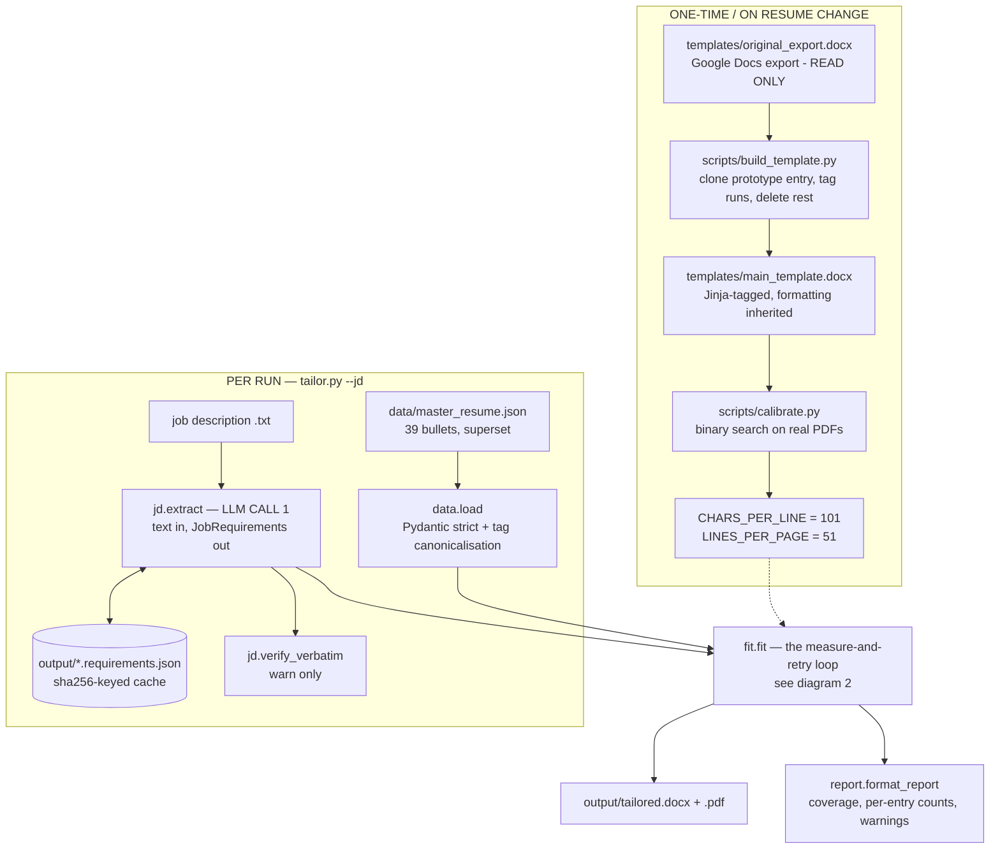
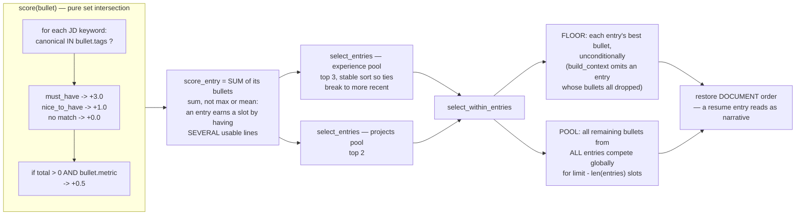
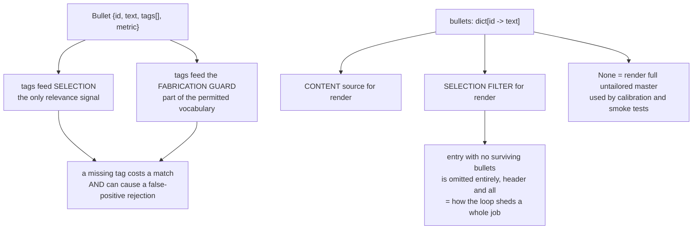

# ResumeTailor — Architecture Walkthrough

How the program works end to end, what is tunable, and what the current design costs.

Companion to `docs/PLAN.md` (which records *why* each phase turned out the way it did).
This file describes *what the code does today*.

---

## 0. The one architectural rule

The LLM only ever sees and emits **plain strings**. Two modules call the API (`jd.py`,
`rewrite.py`) and both exchange text/JSON. One module touches the document (`render.py`)
and it only fills placeholders. Nothing crosses.

That single constraint explains most of the design: because the model cannot be trusted
with layout, layout has to be *inherited* from the real `.docx`, which means fitting has to
be an empirical measure-and-retry loop rather than something the model reasons about.

---

## 1. The whole pipeline



---

## 2. The fit loop in detail

```mermaid
flowchart TD
    START([fit.fit]) --> CHOOSE["choose_entries<br/>rank experience and projects SEPARATELY<br/>caps: 3 experience, 2 projects<br/>RUNS ONCE — never revisited"]
    CHOOSE --> SIZE["_initial_selection_size<br/>binary search largest bullet count<br/>whose ORIGINAL text fits the line budget"]
    SIZE --> SEL

    SEL["select_within_entries limit<br/>1. floor: every entry keeps its best bullet<br/>2. pool: rest compete globally by score"]
    SEL --> RW["rewrite_bullets — LLM CALL 2<br/>batched, budget = 2 x 101 = 202 chars<br/>minus shorten_pct"]
    RW --> GUARD{"check_fabrication<br/>pure, in code"}
    GUARD -->|"offender found"| FABERR([["FabricationError<br/>run dies, exit 1"]])
    GUARD -->|"clean"| RENDER["render.render<br/>docxtpl fill, autoescape=True"]
    RENDER --> MEASURE["render.measure_detail<br/>ONE Word/COM conversion<br/>returns pages AND layout lines"]

    MEASURE --> OVER{"pages > target?"}
    OVER -->|"yes"| ATT{"attempt >= MAX_FIT_ATTEMPTS 3?"}
    ATT -->|"yes"| FITERR([["FitError<br/>names overflowing sections<br/>NEVER silently truncates"]])
    ATT -->|"no"| SHORT["shorten_pct = SHORTEN_SCHEDULE<br/>15 then 25 then 35"]
    SHORT --> RW

    OVER -->|"no"| FILL{"fill ratio < 0.85?<br/>judged on MEASURED lines,<br/>not the estimate"}
    FILL -->|"no"| DONE
    FILL -->|"yes"| GROW{"limit < total AND<br/>grow_attempts < 4?"}
    GROW -->|"no"| WARN["warn: page only N% full"] --> DONE
    GROW -->|"yes"| MORE["limit += deficit // 3<br/>divisor 3 not 2: a restored bullet<br/>may drag 2 header lines with it"]
    MORE --> SEL

    DONE([FitResult<br/>path, pages, iterations, bullets, warnings])
```

Two deliberate asymmetries:

- **Overflow is fatal, underflow is not.** Exhausting `MAX_FIT_ATTEMPTS` raises `FitError`
  naming the largest contributing sections. Exhausting `MAX_GROW_ATTEMPTS` just returns the
  fullest version reached, with a warning.
- **Underflow is judged on the measured line count, not the estimate.** The budget model
  over-predicted a real run into shipping an 82%-full page as "fitted".

Every iteration — grow *or* shrink — costs a full LLM rewrite plus a Word render.

---

## 3. Scoring and selection



The scorer is exact set-membership on canonical tags. No semantics, no embeddings, no
partial credit, no IDF. A tag either matches a canonical exactly or contributes zero, and
**a miss is silent** — nothing warns that a keyword matched nothing.

---

## 4. The two data currencies



---

## 5. Stage notes

### 5a. Template extraction — `scripts/build_template.py`

`templates/original_export.docx` → `templates/main_template.docx`.

It does **not** reconstruct formatting. It finds sections by exact all-caps heading text
(`EDUCATION`, `WORK EXPERIENCES`, `PROJECTS`, `SKILLS`), groups paragraphs into entries,
picks one entry as a **prototype**, clones its XML, injects tags *inside specific runs*,
and deletes every other entry. Formatting survives because it is the same XML.

Two prototypes, two criteria:

| Prototype | Chosen by | Why |
|---|---|---|
| Entry header | `min(header_run_count)` — fewest runs | Cleaner field-to-run mapping |
| Bullet | `min(vertical_cost)` — tightest spacing + indent | The source mixes single and 1.15 spacing; the loose one inflated the doc ~15% of a line per bullet and pushed 1 page to 2 |

Tagged: WORK EXPERIENCES and PROJECTS (nested `` loops) and the SKILLS lines.
Left literal: name, contact line, EDUCATION — they do not vary by posting, and re-running
after a re-export keeps them current.

Project hyperlinks are stripped here, because a baked-in link would point every project at
the prototype's target. They are rebuilt per-entry as `RichText` in `render.py`.

Tag syntax is load-bearing: `` for control flow (a bare `` nests `<w:p>`
inside `<w:p>` — valid XML, invalid OOXML, Word refuses to open it) and `{{r }}` for
RichText (a bare `{{ }}` nests the hyperlink's `<w:r>` inside a `<w:t>`, which may only
contain characters, so the link silently vanishes on read-back).

### 5b. The content store — `data/master_resume.json`

Pydantic with `extra="forbid"`, validated at load so a malformed store fails before any
paid API call.

```
MasterResume
├── contact, education[], skills[]      <- rendered literally, never tailored
├── summary_variants[]                  <- parsed but NEVER RENDERED (dead)
├── experience[]  -> bullets[]
└── projects[]    -> bullets[]
```

`id` is the pipeline's addressing scheme, unique across the file (enforced), used to map
rewrites back onto sources. Tags are canonicalised at load via `config.canonical_tag` /
`TAG_ALIASES`, so JD keywords and bullet tags share a vocabulary before matching.

The store is deliberately a **superset** — larger than any one resume — retaining roles
dropped from the current CV so an ops- or support-flavoured posting can surface them.

### 5c. JD extraction — `jd.py` (LLM call 1)

`client.messages.parse()` with a Pydantic `output_format`, so a bad response is a
validation error at the boundary rather than a mismatch three stages later.

Each `Keyword` is `{phrase, canonical, importance}`:

- **`phrase`** — verbatim from the posting. This is the product feature: mirroring the
  posting's exact wording is what moves keyword scoring. `verify_verbatim()` checks it
  after the fact and warns on any paraphrase.
- **`canonical`** — short lowercase taxonomy tag, run through `TAG_ALIASES`. **This is
  what actually matches.**
- **`importance`** — `must_have` | `nice_to_have`.

The prompt forces atomic entries ("vector databases and semantic search" becomes two) and
skips degree/visa/location requirements.

Cached to `output/<slug>.requirements.json`, keyed by SHA-256 of the JD text — the fit loop
re-rewrites several times per run and none of those retries should re-pay for an extraction
whose input has not changed. `--no-cache` forces re-extraction.

### 5d. Budget estimation — `fit.estimate_lines`

Pure character model that **mirrors `build_context`'s filtering exactly**, so the estimate
and the render always agree on which entries survive:

```
bullet lines   = ceil(len(text) / CHARS_PER_LINE)     # 101
entry lines    = 2 + sum(bullet lines)                # header + title/tab line
                 0 if no bullets survive (header included)
section lines  = sum(entry lines) + 1 if anything survived
fixed overhead = name + contact + EDUCATION (all details) + SKILLS (all groups)
```

### 5e. Rewriting — `rewrite_bullets` (LLM call 2)

One batched call. Each bullet is passed with its current text, its `permitted_skills`
(= tags), and a character budget of `2 x 101 = 202`, floored at 40 after shortening.

System prompt: never introduce a skill/tool/metric/employer not already present; preserve
every number exactly; prefer the posting's phrasing where it names something the bullet
already describes; stay in budget; keep strong-verb-first register.

Any bullet the model drops keeps its original text — better an untailored true line than a
missing one. Unknown ids are skipped rather than guessed at.

### 5f. Fabrication guard — `check_fabrication`

The prompt *asks*; this function *guarantees*. Any violation raises `FabricationError` and
kills the run.

**Vocabulary** = every token in the bullet's text + tags, lowercased, plus the *parts* of
compounds — but only parts containing a letter, so `96.3` never licenses a bare `3`.

**Initialisms** = acronyms formable from runs of 2-5 *consecutive* source words, so a bullet
tagged "computer science fundamentals" supports "CS".

A token is permitted if **any** holds:

- in vocabulary, or in `_BENIGN` (articles, prepositions, pronouns)
- plural match in either direction (`GPUs` <-> `gpu`)
- an all-caps acronym present in the initialism set
- **not a factual claim** — no digit, not an acronym, no internal caps, and either
  lowercase or sentence-initial. *This is what lets "Developed..." become "Built..."*
- a compound whose every part is permitted, split coarsest-separator-first (`/` before
  `[+#./_-]`), each part re-checked with the stricter `sentence_initial=False`

What it cannot launder past: `99%` and the `16` in `Next.js 16` are single tokens with no
separator, so they are checked whole. A source naming `GPT-4.1` tokenises it whole, leaving
`GPT` untraceable alone, so `GPT-5` still fails.

**Every live failure so far was a false positive** — a faithful rewrite rejected over token
shape, not dishonesty. `docs/PLAN.md` has the table of five.

### 5g. Rendering — `render.py`

`tpl.render(context, autoescape=True)` is **required, not optional**: without it a literal
`&` ("Tools & Languages") is swallowed as a malformed entity and RichText renders empty.

Context keys avoid dict attribute names — `entries`, never `items`, because Jinja resolves
`group.items` to the built-in method and injects
`<built-in method items of dict object at 0x...>` into the XML.

### 5h. Measurement — Word COM

`measure_detail()` does one `docx2pdf` conversion and returns both numbers from it:

- `page_count` (pypdf) decides **overflow**
- `line_count` (pypdf, `extraction_mode="layout"`) decides **underflow**

Layout mode preserves visual line breaks, so a wrapped bullet counts once per *rendered*
line. Same measurement `calibrate.py` used to derive `LINES_PER_PAGE`, which is what makes
the two directly comparable.

`keep_active=True` on every call but the last, to avoid Word's ~9s startup per retry. If
Word raises, the loop catches `RuntimeError`, falls back to `estimate_lines`, sets
`pages_are_estimated=True`, and warns.

---

## 6. Adjustable vs fixed

### Tunable as data — `config.py`, no code change

| Constant | Value | Effect |
|---|---|---|
| `MUST_HAVE_WEIGHT` | 3.0 | Must-have keyword match |
| `NICE_TO_HAVE_WEIGHT` | 1.0 | Preferred keyword match |
| `METRIC_BONUS` | 0.5 | Quantified-bullet nudge |
| `MAX_EXPERIENCE_ENTRIES` | 3 | Jobs shown |
| `MAX_PROJECT_ENTRIES` | 2 | Projects shown |
| `TAG_ALIASES` | ~50 entries | **The JD-to-resume vocabulary bridge. Highest-leverage knob in the project.** |
| `MAX_FIT_ATTEMPTS` | 3 | Shrink retries before `FitError` |
| `SHORTEN_SCHEDULE` | (15, 25, 35) | Escalating % cut per retry |
| `MAX_GROW_ATTEMPTS` | 4 | Grow retries before giving up |
| `UNDERFLOW_THRESHOLD` | 0.85 | Below this fill, grow |
| `DEFAULT_PAGE_TARGET` | 1 | Pages |
| `MODEL` / `EFFORT` / `MAX_TOKENS` | sonnet-5 / medium / 21k | **Coupled.** Reasoning tokens come out of `max_tokens`, and non-streaming caps at 21,333, so raising effort past `medium` means switching to streaming, not raising the ceiling. |

### Measured, not chosen — re-run `scripts/calibrate.py`

| Constant | Value |
|---|---|
| `CHARS_PER_LINE` | 101 |
| `LINES_PER_PAGE` | 51 |

Binary-searched against real Word-rendered PDFs, written back into `config.py` by regex,
and verified against two anchors: 39 bullets to 3 pages, 13-bullet subset to 1 page.
**Re-run after any template, font, or margin change.**

### Per-run CLI

`--jd`, `--out`, `--pages`, `--template`, `--experience`, `--projects`, `--no-cache`.

### Hardcoded — requires a code change

| Thing | Where |
|---|---|
| `_TARGET_LINES_PER_BULLET = 2` (sets the 202-char budget) | `fit.py:27` — arguably belongs in config |
| Growth divisor `+1` | `fit.py:314` |
| Entry header cost of 2 lines | `fit.py:86` |
| Scoring *shape* — linear sum over set intersection | `rewrite.py` |
| Floor rule: 1 bullet per entry | `rewrite.py:145` |
| Entries chosen once, never revisited | `fit.py:231` |
| Document-order restoration | `rewrite.py:92,154` |
| `_BENIGN`, `_TOKEN`, `_SPLIT_PATTERNS`, `_INITIALISM_LENGTHS` (2-5) | `rewrite.py` |
| Both system prompts | `jd.py:56`, `rewrite.py:337` |
| `SECTIONS` heading names | `build_template.py:133` |
| Which sections are tagged vs literal | `build_template.py` |
| `_LINK_COLOR = 0000EE` | `render.py:20` |

---

## 7. Advantages

**Formatting fidelity is absolute, not approximate.** The output *is* the document — same
XML, same fonts, same tab stops. Structurally guaranteed rather than prompt-guaranteed.

**Selection is deterministic.** Same JD + same master resume = same entries, every time.
Reproducible, debuggable, and free. It is also *why* the fit loop can retry at all: if
selection were an LLM call, each iteration would cost twice as much and drift.

**Fabrication is prevented in code, not in the prompt.** `check_fabrication` is pure,
unit-testable, and cannot be talked out of its position.

**Schema validation at both API boundaries.** `messages.parse()` with Pydantic, never prose
parsing.

**Failure is loud.** Unfittable content raises with named overflowing sections. Fabrication
kills the run. Missing must-haves are reported. The tool never quietly ships something
worse than asked for.

**Cheap iteration.** JD extraction is content-hashed and cached across retries; Word stays
warm across renders.

**The template is regenerable.** Re-export, copy over the baseline, run one script.

**Calibration is empirical**, measured from real PDFs rather than derived from a
font-metrics formula that would be wrong in a dozen edge cases.

**Testable without Word or an API key** — 59 offline tests, including regressions for every
XML gotcha that produced a well-formed-but-broken file.

---

## 8. Downsides

### Ranking

**Tag-overlap matching is the biggest weakness, and it is hard exact-match.** Nothing
understands that `communication` is close to `communication skills`, or that `data analysis`
is what "Analyze data, workflows, and user feedback" means. Every miss is silent. Quality is
entirely hostage to hand-maintained tag coverage plus `TAG_ALIASES`.

**Soft-skill keywords carry the same weight as named technologies.** A `must_have` of
"attention to detail" is worth 3.0, exactly as much as Python — and since soft skills rarely
canonicalise onto a tag, that is usually 3.0 points of dead weight.

**Ubiquitous tags are not downweighted.** `python` is on nearly every bullet, so it
contributes 3.0 to almost everything and decides nothing. No IDF-style correction, so an
unusual match and a universal one count identically.

**No redundancy penalty.** The pool ranks bullets independently and will happily select
three near-duplicates over three complementary lines.

**Entry scoring rewards bullet count**, since `score_entry` is a sum.

**Zero-scoring entries can still be selected.** If fewer than the cap score above zero, the
remaining slots fill with 0.0 entries in document order. Nothing checks relevance.

**Extraction instability.** Keyword list, length, and the must/nice split are all model
decisions; a re-extraction of the same JD can reshuffle the ranking. The cache hides this.

### Fitting

**No entry-level backtracking.** `choose_entries` runs once and freezes. If the top two
projects are verbose, the loop can only shrink their bullets — never swap in a shorter
third-ranked project. The only lever is `--projects` / `--experience`.

**Uniform character budget.** Every bullet gets 202 chars regardless of importance.

**Every iteration is a full LLM call plus a Word render**, grow or shrink.

**Only bullets are negotiable.** EDUCATION details and all SKILLS groups render in full,
always, as fixed overhead — and the skills line is not tailored to the posting at all.

**Word/COM is the least portable part.** Windows + Word only, ~9s cold start, and a modal
dialog hangs conversion. The fallback degrades to the estimate that already proved
optimistic enough to ship an 82%-full page.

**Binary search assumes monotonicity** of `estimate_lines` in `limit`. Mostly true, but the
entry-header step function (0 to 1 bullet adds 2 lines at once) means it is not guaranteed.

### Guard

**Its failures are false positives by construction** — it fails on tokenisation, not
dishonesty. And it is a hard, run-killing failure with no override.

**Vocabulary is per-bullet**, so a rewrite cannot use a term another bullet in the same job
legitimately establishes.

**Known holes, accepted deliberately:** a fabricated lowercase or sentence-initial common
word passes; an invented acronym coincidentally matching a run of source-word initials
passes. The risk being guarded is an invented tool or number, and those are caught.

### Other

**`summary_variants` is parsed and validated but never rendered.** `build_context` returns
only `experience`, `projects`, `skills`. Dead schema.

**`verify_verbatim` warns but does not fail** — a paraphrased phrase silently breaks the
keyword-mirroring premise and the run still exits 0.

**`build_template.py` locates sections by exact all-caps heading text**; rename a heading in
the Google Doc and it errors out (loudly, at least).

**Per-entry bullet spacing cannot be preserved in principle.** One prototype drives every
bullet, so any bullet may render where another's used to. Normalised to the tightest
variant — correct, but a real fidelity loss versus the original.
